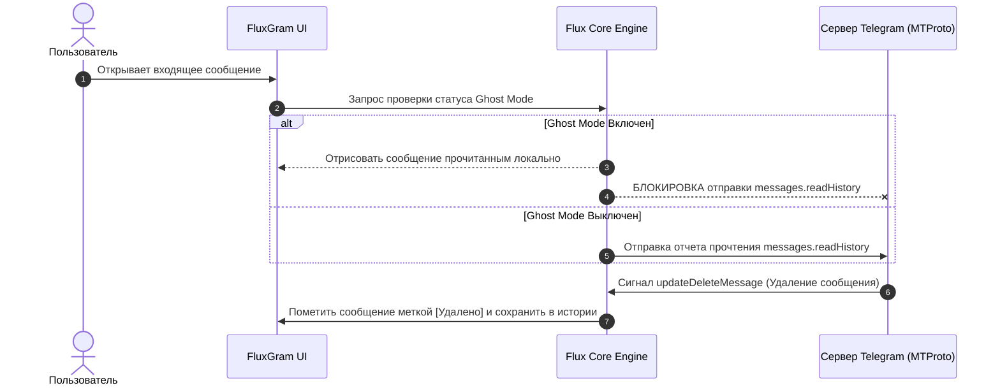

<div align="center">

```
  _____ _     _   ___  ______ _____  ___  ___  ___ 
 |  ___| |   | | | \ \/ /  _ \  ___|/ _ \/ _ \/ _ \
 | |_  | |   | | | |\  /| |_| | |_ / /_\/ /_\/ /_\ \
 |  _| | |___| |_| |/  \|  _ <|  _||  _  |  _  |  _  |
 |_|   |_____|\___//_/\_\_| \_\_|  |_| |_|_| |_|_| |_|
                                                      
```

# 🚀 FluxGram Desktop — Полное техническое руководство

### *Современный, высоковольтный и конфиденциальный клиент Telegram на базе Telegram Desktop & Flux Core*

[](LICENSE)
[](https://github.com/telegramdesktop/tdesktop)
[](https://github.com/greenyarik0505-jpg/FluxGramDesktop)
[](https://isocpp.org/)
[](https://www.qt.io/)
[](https://visualstudio.microsoft.com/)

</div>

---

## 📋 Оглавление

1. [Обзор проекта и Философия](#1-обзор-проекта-и-философия)
2. [Полный функциональный матрикс](#2-полный-функциональный-матрикс)
3. [Подробное описание работы приватностей](#3-подробное-описание-работы-приватностей)
   - [3.1. Механика Ghost Mode (Режим Призрака)](#31-механика-ghost-mode-режим-призрака)
   - [3.2. Локальное сохранение удаленных сообщений](#32-локальное-сохранение-удаленных-сообщений)
   - [3.3. Сохранение истории редактирования](#33-сохранение-истории-редактирования)
   - [3.4. Автоматическое сохранение исчезающих медиа](#34-автоматическое-сохранение-исчезающих-медиа)
4. [Подробная структура и инвентаризация C++ кода](#4-подробная-структура-и-инвентаризация-c-кода)
   - [4.1. Кастомный модуль `flux`](#41-кастомный-модуль-flux)
   - [4.2. Модифицированные ядровые файлы Telegram](#42-модифицированные-ядровые-файлы-telegram)
5. [Архитектура и потоки данных (Architecture & Data Flow)](#5-архитектура-и-потоки-данных-architecture--data-flow)
6. [Получение API_ID и API_HASH](#6-получение-api_id-и-api_hash)
7. [Полный сборщик и пошаговая инсталляция](#7-полный-сборщик-и-пошаговая-инсталляция)
   - [7.1. Сборка на Windows 10 / 11 (MSVC 2022 + Qt 6)](#71-сборка-на-windows-10--11-msvc-2022--qt-6)
   - [7.2. Сборка на Linux (Ubuntu / Arch / Debian)](#72-сборка-на-linux-ubuntu--arch--debian)
   - [7.3. Сборка на macOS (Clang + Qt 6)](#73-сборка-на-macos-clang--qt-6)
8. [Расширенные флаги конфигурации CMake](#8-расширенные-флаги-конфигурации-cmake)
9. [Руководство по решению проблем (Troubleshooting Guide)](#9-руководство-по-решению-проблем-troubleshooting-guide)
10. [Безопасность и защищенность данных](#10-безопасность-и-защищенность-данных)
11. [Юридическая информация и Лицензирование](#11-юридическая-информация-и-лицензирование)

---

## 1. Обзор проекта и Философия

**FluxGram Desktop** — это независимый модифицированный клиент для мессенджера Telegram. Проект создан с целью предоставить пользователю максимально широкий набор инструментов контроля своей конфиденциальности и автономности.

В основе **FluxGram** лежит официальный открытый код приложения **Telegram Desktop** версии 7.0.4+, в который интегрировано оптимизированное функциональное ядро **Flux Core**.

### Ключевые принципы разработки:
* 🔒 **Полная локальность:** Никаких внешних сторонних серверов. Все настройки, удаленные сообщения и история изменений сохраняются исключительно на жестком диске вашего компьютера.
* ⚡ **Высокая производительность:** Интеграция выполняется прямо на уровне компиляции C++20 с использованием родных библиотек Qt 6, без применения накладных веб-оберток (Electron/Webview).
* 🎨 **Индивидуальный дизайн:** Специально разработанный официальный интерфейс FluxGram и собственный раздел настроек в приложении.

---

## 2. Полный функциональный матрикс

| Функциональный блок | Официальный Telegram | FluxGram Desktop |
| :--- | :---: | :---: |
| **Базовые звонки и групповые чаты** | ✅ | ✅ |
| **Секретные чаты и шифрование MTProto 2.0** | ✅ | ✅ |
| **Скрытие галочек прочтения сообщений (Ghost Mode)** | ❌ | ✅ |
| **Скрытие присутствия Онлайн** | ❌ | ✅ |
| **Невидимый просмотр историй (Stories)** | ❌ | ✅ |
| **Сохранение удаленных сообщений в чате** | ❌ | ✅ |
| **«Keep locally» (Сохранение удаляемых в группах сообщений)** | ❌ | ✅ |
| **«Save to self» (Сохранение копии при спам-репорте)** | ❌ | ✅ |
| **История исходных текстов до редактирования** | ❌ | ✅ |
| **Просмотр сгорающих фото/видео без таймера** | ❌ | ✅ |

---

## 3. Подробное описание работы приватностей

### 3.1. Механика Ghost Mode (Режим Призрака)
Режим призрака перехватывает отправку outgoing-пакетов подтверждения прочтения на уровне класса `ApiWrap`:
* При получении новых входящих сообщений клиент не посылает на сервера Telegram запрос `messages.readHistory`.
* Сообщения помечаются прочитанными локально на экране пользователя, но для отправляющей стороны они остаются непрочитанными (одна галочка).
* Если пользователь сам начинает писать ответ, отправка отчета о наборе текста (`messages.setTyping`) блокируется до момента отправки самого сообщения.

### 3.2. Локальное сохранение удаленных сообщений
При получении от сервера команды на удаление сообщений (`updateDeleteMessages` или `deletePhoneCallHistory`) класс `HistoryItem` в модуле `flux` предотвращает удаление записи из структуры локального хранилища:
* Флаг сообщения меняется на `MessageFlag::FluxDeleted`.
* Текст сообщения снабжается плашкой `[Удалено]` со временем удаления.
* Медиафайлы (изображения, голосовые заметки, видеоклипы) сохраняются в локальном кэше `tdata`.

### 3.3. Сохранение истории редактирования
При редактировании сообщения противоположной стороной Telegram присылает обновление `updateEditMessage`. FluxGram создает связанный список версий сообщения:
* Первоначальный вариант сохраняется в объекте `FluxEditHistory`.
* Пользователь может кликнуть на метку `[Изменено]`, чтобы вызвать контекстное окно с просмотром всех предыдущих редакций текста.

### 3.4. Автоматическое сохранение исчезающих медиа
Для фото и видеофайлов с установленным таймером самоликвидации (Self-Destruct TTL):
* Блокируется запуск таймера удаления после открытия.
* Отключается запрет на снятие скриншотов и сохранение на диск.

---

## 4. Подробная структура и инвентаризация C++ кода

### 4.1. Кастомный модуль `flux`
Все уникальные компоненты FluxGram расположены в директории `Telegram/SourceFiles/flux/`:

```
flux/
├── flux_infra.cpp / .h       # Системная инфраструктура и инициализация модуля
├── flux_lang.cpp / .h        # Строки локализации интерфейса на русском и английском
├── flux_settings.cpp / .h    # Контроллер конфигурации (tdata/flux_settings.json)
├── flux_state.cpp / .h       # Глобальное состояние режима призрака
├── flux_url_handlers.cpp     # Обработка внутренних URL-схем flux://
├── flux_worker.cpp / .h      # Фоновые потоки обработки кэша
├── features/                  # Модули фич
│   ├── filters/               # Фильтрация сообщений и спама
│   ├── message_shot/          # Генератор скриншотов диалогов
│   └── ghost/                 # Логика режима призрака
├── ui/                        # Интерфейсы
│   ├── flux_userpic.cpp       # Отрисовка кастомных аватаров
│   └── settings/
│       ├── settings_main.cpp  # Окно настроек FluxGram
│       └── settings_main.h
```

### 4.2. Модифицированные ядровые файлы Telegram
1. **`version.h`:**
   * Изменены константы `AppName = "FluxGram"_cs;` и `AppFile = "FluxGram"_cs;`.
2. **`settings_main.cpp`:**
   * Внедрена кнопка `.title = tr::flux_FluxPreferences()` в секции главных настроек.

---

## 5. Архитектура и потоки данных (Architecture & Data Flow)



---

## 6. Получение API_ID и API_HASH

Для сборки собственного приложения Telegram необходимо получить пары API ключей:

1. Перейдите на официальный портал авторизации [my.telegram.org](https://my.telegram.org/).
2. Введите ваш номер телефона и подтвердите вход кодом из Telegram.
3. Перейдите в раздел **API development tools**.
4. Заполните форму:
   * **App title:** `FluxGram Desktop`
   * **Short name:** `fluxgram`
   * **Platform:** `Desktop`
5. Нажмите **Create application**.
6. Скопируйте полученные `api_id` и `api_hash` для подстановки в команду сборки CMake.

---

## 7. Полный сборщик и пошаговая инсталляция

### 7.1. Сборка на Windows 10 / 11 (MSVC 2022 + Qt 6)

#### Подготовка окружения через PowerShell:
```powershell
# Установка Visual Studio Build Tools, CMake и Ninja через winget
winget install --id Kitware.CMake -e --accept-source-agreements
winget install --id Ninja-build.Ninja -e --accept-source-agreements
winget install --id Microsoft.VisualStudio.2022.BuildTools -e --override "--passive --add Microsoft.VisualStudio.Workload.VCTools --includeRecommended"
```

#### Запуск компиляции:
```cmd
call "C:\Program Files (x86)\Microsoft Visual Studio\2022\BuildTools\VC\Auxiliary\Build\vcvars64.bat"
set PATH=C:\Program Files\CMake\bin;%PATH%

cd /d d:\fluxgram\tdesktop
cmake -B build -S . ^
    -G "Ninja" ^
    -D CMAKE_BUILD_TYPE=Release ^
    -D Qt6_DIR=d:/fluxgram/Qt/6.8.2/msvc2022_64/lib/cmake/Qt6 ^
    -D CMAKE_PREFIX_PATH="d:/fluxgram/Qt/6.8.2/msvc2022_64;d:/fluxgram/vcpkg/installed/x64-windows" ^
    -D TDESKTOP_API_ID=YOUR_API_ID ^
    -D TDESKTOP_API_HASH=YOUR_API_HASH

cmake --build build --config Release
```

### 7.2. Сборка на Linux (Ubuntu / Arch / Debian)

#### Установка зависимостей в Ubuntu/Debian:
```bash
sudo apt update
sudo apt install -y build-essential cmake ninja-build qt6-base-dev qt6-image-formats-plugins libssl-dev libcrypto++-dev libavcodec-dev libavformat-dev libswscale-dev
```

#### Сборка:
```bash
git clone --recursive https://github.com/greenyarik0505-jpg/FluxGramDesktop.git fluxgram
cd fluxgram
cmake -B build -S . -G "Ninja" -D CMAKE_BUILD_TYPE=Release -D TDESKTOP_API_TEST=ON
cmake --build build
```

### 7.3. Сборка на macOS (Clang + Qt 6)

#### Установка зависимостей через Homebrew:
```bash
brew install cmake ninja qt@6 ffmpeg openssl
```

#### Сборка:
```bash
cmake -B build -S . -G "Ninja" -D CMAKE_PREFIX_PATH="$(brew --prefix qt@6)" -D TDESKTOP_API_TEST=ON
cmake --build build
```

---

## 8. Расширенные флаги конфигурации CMake

| Флаг CMake | Значение по умолчанию | Описание |
| :--- | :---: | :--- |
| `TDESKTOP_API_TEST` | `OFF` | Использовать тестовые ключи Telegram API для отладки. |
| `DESKTOP_APP_DISABLE_AUTOUPDATE` | `OFF` | Отключить модуль автообновления клиента. |
| `DESKTOP_APP_USE_PACKAGED` | `OFF` | Использовать системные динамические библиотеки Linux. |
| `DESKTOP_APP_SPECIAL_TARGET` | `""` | Имя целевой сборки для инсталляторов. |

---

## 9. Руководство по решению проблем (Troubleshooting Guide)

#### Ошибка: `Neither Qt6 nor Qt5 is found`
* **Причина:** CMake не может найти директорию с библиотеками Qt.
* **Решение:** Укажите явный путь через `-D Qt6_DIR=C:/Qt/6.8.2/msvc2022_64/lib/cmake/Qt6`.

#### Ошибка компилятора: `out of memory / C1060`
* **Причина:** Нехватка оперативной памяти при сборке на слишком большом количестве параллельных потоков.
* **Решение:** Ограничьте количество потоков сборки Ninja: `cmake --build build -j 2`.

---

## 10. Безопасность и защищенность данных

* **Сквозное шифрование:** Все личные сообщения, файлы и звонки обрабатываются исключительно оригинальной библиотекой **TDLib / MTProto**, разработанной командой Telegram.
* **Отсутствие телеметрии:** FluxGram не содержит трекеров, систем аналитики или внешней отправки статистики.
* **Изолированный кэш:** Локальная база данных хранится в зашифрованном контейнере `tdata`.

---

## 11. Юридическая информация и Лицензирование

Проект **FluxGram Desktop** публикуется на условиях лицензии **GNU General Public License v3.0 (GPLv3)**.

### Авторы и Правообладатели:
1. **Telegram Desktop:** © Telegram FZ-LLC, исходный код [github.com/telegramdesktop/tdesktop](https://github.com/telegramdesktop/tdesktop) под лицензией GPLv3.
2. **FluxGram Desktop:** © FluxGram Development Team, 2026.

---

<div align="center">

**FluxGram Desktop** — Создано с уважением к свободе пользователей и открытому исходному коду.

</div>
